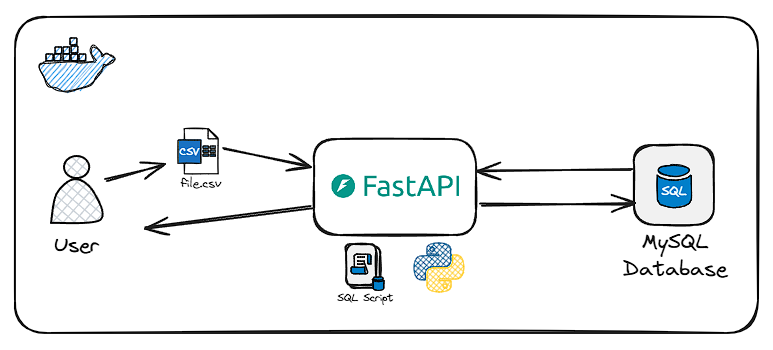

# globant-api-db-migration


## Objective
This project aims to deploy an API to receive historical data from csv files and ingest into a MySQL database.
Then, the user can extract data from the API endpoints.


# Architecture



Components:
- Postman: Application for access the API. You can use the FastAPI on the browser if you want. 
- API: Built with Python and FastAPI.
- MySQL Database: To store and retrieve data.

## Project behavior
1. Uploading historical data  
    - The user makes a requisition to the enpoints jobs, employees and department with the historical csv file.  
        - The requisition is made with the POST method and the csv file is sent in the body of the request.   
    - The API will validate the csv file before ingest the data into the MySQL database.  
        - If the csv file is not valid or has more than 1000 rows, the API will return an error message.  
        - If the csv file is valid and not empty, the API will ingest the data into the MySQL database.
    - The API calls a MySQL connection with a query to insert the data into the database.
        - The API will return a success message with the number of records ingested.
        - If there are any fields missing in the csv file, the API will not ingest the missing records and will return a message with the number of records ingested and not ingested. Beyond that, the API will return which fields are missing in the csv file for each line of the file.
2. Retrieving data
    - The user can make a requisition to the API to retrieve data from the MySQL database.
        - The requisition is made with the GET method and the API will return the data in JSON format.
    - The API will call a MySQL connection with a query to retrieve the data from the database.
        - The API will return the data in JSON format.
        - If there are no records in the database, the API will return an empty list.

## Sample Data Input
| INPUT | DESCRIPTION |
|:--------|:-------------|
| `departments.csv` | List of the departments that contains the id and name of the department. |
| `hired_employees.csv` | List of the hired employees that contains the id, name and the hired datetime of the employees plus the department and job id's to integration with the others tables. |
| `jobs.csv` | List of the jobs that contains the id and name of the jobs. |


## Available endpoints:

| ENDPOINT | DESCRIPTION |
|:--------|:-------------|
| `POST /departments` | Ingest departments data from a CSV file into a MySQL database.
| `POST /employees` | Ingest employees hired data from a CSV file into a MySQL database.
| `POST /jobs` | Ingest jobs data from a CSV file into a MySQL database.
| `DELETE /departments` | Delete departments table (for testing purpose).
| `DELETE /employees` | Delete employees table (for testing purpose).
| `DELETE /jobs` | Delete jobs table (for testing purpose).
| `GET total_employees_hired_by_quarters` | Get data with the total of employees hired for each job and department in 2021 divided by quarter, ordered alphabetically by department and job.
| `GET total_employees_hired_more_than_year_mean_by_department` | Get data with the list of ids, name and number of employees hired of each department that hired more employees than the mean of employees hired in 2021 for all the departments, ordered by the number of employees hired  (descending).


## DEV Requirements
- Docker
- Docker-compose
- Postman application (or equivalent for interact with the endpoints)

## Config the DEV enviroment
```
python3 -m venv .venv
source .venv/bin/activate
pip install --upgrade -r api/requirements-api.txt

pip install pre-commit
pre-commit install
```
Create a `.env` file with a config like this:
```
MYSQL_HOST=mysql
MYSQL_USER=user
MYSQL_PASSWORD=1234
```

## Testing in DEV
1. Run all the containers with the command `docker-compose up -d`. Wait for the services goes up.


2. Use the Postman to interact with the API.  
    2.1 Open the Postman application and import the `globant-api-db-migration.postman_collection.json` file.  
    2.2 One example of the request to retrieve the total of employees hired by quarters in 2021 is:
    

3. If you want to interate inside the MySQL database, follow these steps:  
  3.1 run `docker ps` and look for the CONTAINER ID of the MySQL continer 
  3.2 Enter in the MySQL container running this command: `docker exec -it 251 mysql -u user -p`. Then input the password that you've configured before.  
  3.3 Run the command `USE database;`  
  3.4 Do your queries, for example: `SELECT * from employees;` or the queries that have been configurated for the enpoints and you will have these results:  
 3.4.1 Endpoint total_employees_hired_by_quarters/2021:  
    

    3.4.2 Endpoint total_employees_hired_more_than_year_mean_by_department/2021:  
    


## Project's folder structutre
globant-api-db-migration  
├── api   
│   ├── app  
│   │   ├── db.py               # Functions to use with the database connection  
│   │   ├── main.py             # Main code of the API service  
│   │   ├── utils.py            # Utils functions  
│   │   └── validations.py      # Functions for validate the data and process  
│   ├── requirements-api.txt    # Libraries to use in whitin the Docker container API  
│   └── Dockerfile.api          # Docker config file to build the API  
├── csv_files  
│   ├── departments.csv         # Sample data for testing purspose  
│   ├── hired_employees.csv     # Sample data for testing purspose  
│   └── jobs.csv                # Sample data for testing purspose  
├── sql  
│   ├── create_tables.sql       # Query used to the creates the tables in the MySQL database  
│   ├── query1.sql              # Query used in the endpoint total_employees_hired_by_quarters  
│   └── query2.sql              # Query used in the endpoint  total_employees_hired_more_than_year_mean_by_department  
├── docker-compose.yml          # Docker config file for the project's services  
└── README.md                   # This file :)  

