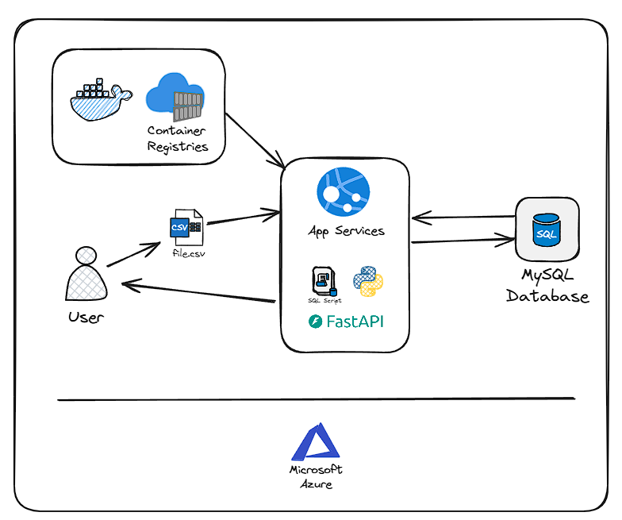
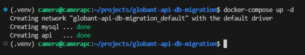
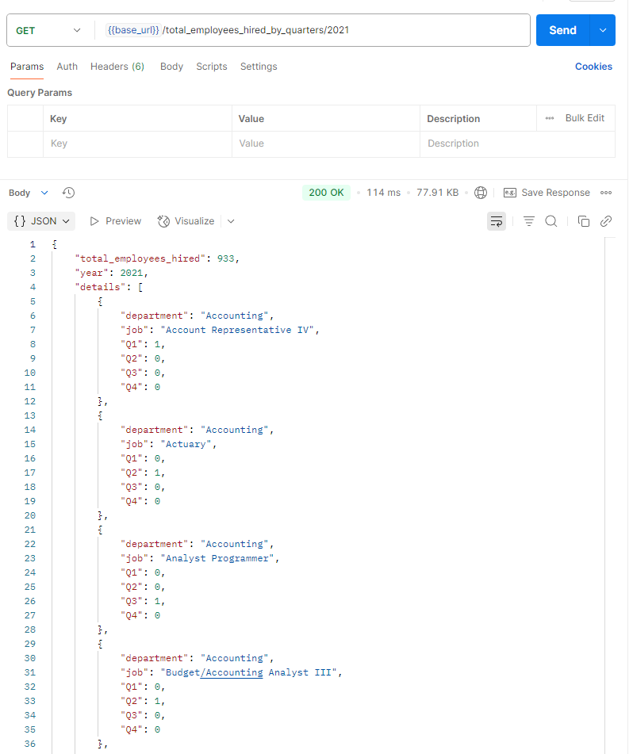
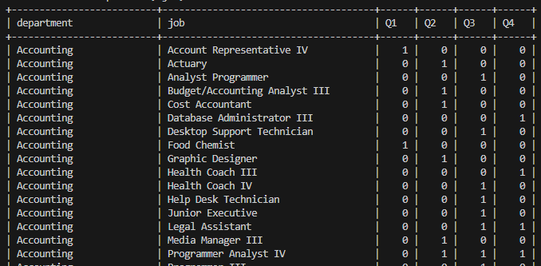
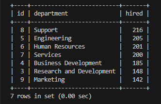

# globant-api-db-migration
A FastAPI-based microservice to ingest and query historical employee data using MySQL.

## Objective
This project provides a REST API to ingest historical CSV data into a MySQL database and expose endpoints to query this data.

# Architecture



Components:
- Postman: Used to test the API. Alternatively, you can use the built-in FastAPI Swagger UI. 
- API: Developed with Python and FastAPI.
- MySQL Database: Stores the ingested data and supports query execution.
- Container Registry: Stores the Docker images for the API.

## Project behavior
1. **Uploading historical data**  
    - The user makes a requisition to the enpoints jobs, employees and department with the historical csv file.  
        - The requisition is made with the POST method and the csv file is sent in the body of the request.   
    - The API will validate the csv file before ingest the data into the MySQL database.  
        - If the csv file is not valid or has more than 1000 rows, the API will return an error message.  
        - If the csv file is valid and not empty, the API will ingest the data into the MySQL database.
    - The API calls a MySQL connection with a query to insert the data into the database.
        - The API will return a success message with the number of records ingested.
        - If there are any fields missing in the csv file, the API will not ingest the missing records and will return a message with the number of records ingested and not ingested. Beyond that, the API will return which fields are missing in the csv file for each line of the file.
2. **Retrieving data**
    - The user can make a requisition to the API to retrieve data from the MySQL database.
        - The requisition is made with the GET method and the API will return the data in JSON format.
    - The API will call a MySQL connection with a query to retrieve the data from the database.
        - The API will return the data in JSON format.
        - If there are no records in the database, the API will return an empty list.

## Sample Data Input
| INPUT | DESCRIPTION |
|:--------|:-------------|
| `departments.csv` | List of the departments that contains the id and name of the department. |
| `hired_employees.csv` | List of the hired employees that contains the id, name and the hired datetime of the employees plus the department and job id's to integration with the others tables. |
| `jobs.csv` | List of the jobs that contains the id and name of the jobs. |


## Available Endpoints:

| ENDPOINT | DESCRIPTION |
|:--------|:-------------|
| `POST /departments` | Upload departments data from a CSV file
| `POST /employees` | Upload employee data from a CSV file
| `POST /jobs` | Upload job data from a CSV file
| `DELETE /departments` | Delete all department records (for testing only).
| `DELETE /employees` | Delete all employee records (for testing only).
| `DELETE /jobs` | Delete all job records (for testing only).
| `GET total_employees_hired_by_quarters` | Get employees hired in any year by job and department per quarter.
| `GET total_employees_hired_more_than_year_mean_by_department` | Get departments with more hires than the year average.


## DEV Requirements
- Docker
- Docker-compose
- Postman application (or equivalent for interact with the endpoints)

## Setup the DEV enviroment
1. Clone the repository:
   ```
   git clone
   ```
2. Change to the project directory:
   ```
   cd globant-api-db-migration
   ```
3. Create a `.env` file in the root of the project with the following content:
   ```
   MYSQL_HOST=mysql
   MYSQL_USER=user
   MYSQL_PASSWORD=1234
   ```
4. Install the Python dependencies:
   ```
   python3 -m venv .venv
   source .venv/bin/activate
   pip install --upgrade pip
   pip install --upgrade -r api/requirements-api.txt
   ```
5. Install pre-commit hooks:
   ```
   pip install pre-commit
   pre-commit install
   ```

## Testing in DEV

1. Run all the containers with the command `docker-compose up -d`. Wait for the services are up and running.  


2. Use the Postman to interact with the API.  
    2.1 Open the Postman application and import the `globant-api-db-migration.postman_collection.json` file.  
    2.2 One example of the request to retrieve the total of employees hired by quarters in 2021 is:
    

3. If you want to interact inside the MySQL database, follow these steps:  
    3.1 run `docker ps` and look for the CONTAINER ID of the MySQL container  
    3.2 Enter in the MySQL container running this command: `docker exec -it 251 mysql -u user -p`. Then input the password that you've configured before.  
    3.3 Run the command `USE database;`  
    3.4 Do your queries, for example: `SELECT * from employees;` or the queries that have been configurated for the endpoints and you will have these results:  
    3.4.1 Endpoint total_employees_hired_by_quarters/2021:  
          
    3.4.2 Endpoint total_employees_hired_more_than_year_mean_by_department/2021:  
          


## Deploy in PRD

This project is designed to be deployed in a Azure Cloud environment, but you can deploy it in any cloud provider that supports Docker containers.

1. Install Azure CLI  

2. Create a instance of Azure Database for MySQL - Flexible Server in the Azure portal.  
    - Create a new MySQL server with the following configuration:
        - Server name: `globant-mysql-server`
        - Admin username: `globant`
        - Password: `<redacted>`
        - Location: `East US`
        - Version: `8.0`
        - Compute + storage: `Burstable, B1ms, 1 vCores, 2 GiB RAM, 20 GiB storage, Auto scale IOPS`  

3. You will have to create manually the database and tables in the MySQL server.  
    - Connect to the MySQL server using a MySQL client or the Azure portal.  
    - Run the SQL script `sql/create_tables.sql` to create the necessary tables.  

4. Create an Azure Container Registry (ACR) to store the Docker images. 
    - Create a new ACR with the following configuration:
        - Name: `globant`
        - Location: `East US`
        - SKU: `Basic`
5. Build the Docker image for the API and push it to the ACR.
    - Log in to the ACR:
        ```
        az acr login --name globantacr.azurecr.io
        ```
    - Run the following command in the project folder:
        ```
        docker build -t globantacr.azurecr.io/globant-api-db-migration:latest ./api
        ```
    - Push the image to the ACR:
        ```
        docker push globantacr.azurecr.io/globant-api-db-migration:latest
        ```
6. Create an App Service in Azure to run the API.
    - Create a new App Service with the following configuration:
        - Name: `globant-api-db-migration`
        - Publish: `Docker Container`
        - Operating System: `Linux`
        - Region: `East US`
        - App Service Plan: `Free`
7. Configure the App Service to use the Docker image from the ACR.
    - In the App Service settings, go to `Container settings` and select `Azure Container Registry`.
    - Select the ACR you created earlier and choose the image `globantacr-api-db-migration:latest`.
8. Configure the App Service to connect to the MySQL database.
    - In the App Service settings, go to `Configuration` and add the following application settings:
        - `MYSQL_HOST`: `globant-mysql-server.mysql.database.azure.com`
        - `MYSQL_USER`: `globant`
        - `MYSQL_PASSWORD`: `<REDACTED>`
9. Deploy the App Service and wait for it to be ready.
10. Once the App Service is running, you can access the API at the URL: `https://<your-app-service-name>.azurewebsites.net`.

## Testing in PRD
1. Test the API endpoints using Postman or any other API client.
2. Use the same endpoints as in the development environment, but with the URL of your App Service.
   - For example, to test the endpoint `total_employees_hired_by_quarters/2021`, you would use:
    ```
    GET https://<your-app-service-name>.azurewebsites.net/total_employees_hired_by_quarters/2021
    ```
3. You can also test the API using the built-in FastAPI Swagger UI by navigating to:
   ```
   https://<your-app-service-name>.azurewebsites.net/docs
   ```
4. If you want, you can also test the API using the MySQL database in Azure.  
   - Connect to the MySQL database using a MySQL client or the Azure portal.
   - Run the same queries as in the development environment to verify the data.
   

## Results

The API will return the results in JSON format, and you can see the results bellow:
 - [Endpoint GET total_employees_hired_by_quarters/2021](docs/results/get_total_employees_hired_by_quarters_2021.json)
 - [Endpoint GET total_employees_hired_more_than_year_mean_by_department/2021](docs/results/get_total_employees_hired_more_than_year_mean_by_department_2021.json)
 - [Endpoint POST employees](docs/results/post_employees.json)


## Project Folder Structure
```
globant-api-db-migration  
├── api   
│   ├── app  
│   │   ├── db.py               # Functions to use with the database connection  
│   │   ├── main.py             # Main code of the API service  
│   │   ├── utils.py            # Utils functions  
│   │   └── validations.py      # Functions for validate the data and process  
│   ├── requirements-api.txt    # Libraries to use in within the Docker container API  
│   └── Dockerfile.api          # Docker config file to build the API  
├── csv_files  
│   ├── departments.csv         # Sample data for testing purpose  
│   ├── hired_employees.csv     # Sample data for testing purpose  
│   └── jobs.csv                # Sample data for testing purpose  
├── docs
│   ├── results
│   │   ├── get_total(...).json # Results of the endpoint total_employees_hired_by_quarters/2021
│   │   ├── get_total(...).json # Results of the endpoint total_employees_hired_more_than_year_mean_by_department/2021
│   │   └── post_employees.json # Results of the endpoint POST employees
│   ├── architecture.png        # Image of Architecture diagram of the project
│   ├── image-2.png             # Image of request in Postman to the endpoint total_employees_hired_by_quarters/2021
│   ├── image-3.png             # Image of request in Postman to the endpoint total_employees_hired_more_than_year_mean_by_department/2021
│   ├── image-4.png             # Image of request in MySQL to the endpoint total_employees_hired_by_quarters/2021      
│   └── image.png               # Image of the containers running in the Docker environment
├── sql  
│   ├── create_tables.sql       # Query used to the creates the tables in the MySQL database  
│   ├── query1.sql              # Query used in the endpoint total_employees_hired_by_quarters  
│   └── query2.sql              # Query used in the endpoint total_employees_hired_more_than_year_mean_by_department  
├── docker-compose.yml          # Docker config file for the project's services  
└── README.md                   # This file :)  
```

## License

This project is licensed under the MIT License - see the [LICENSE](LICENSE) file for details.

## Author
- Marcelo Camera |  [github](https://github.com/mcamera) |  [mcamera.dev@pm.me](mcamera.dev@pm.me)
